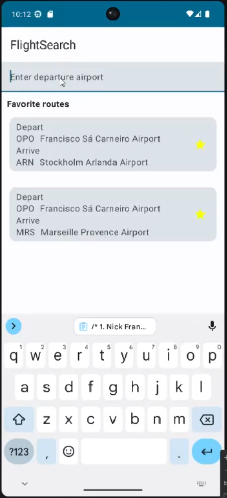

# CS 492 Mobile Software Development

Developed an Android flight search application that utilizes data persistence using the the Room database framework. 

## Assignment Info

### Objectives 
Successfully create an Android project in Android Studio that utilizes Jetpack Compose and Kotlin to create an app that utilizes data persistence using the Room database framework.

### Tasks
- This assignment leverages material in Unit 6 of Android Basics with Compose, notably Room databases
    - Be sure to consult the course materials for help as needed
- Create a customized implementation of a subset of the following project in Part 3 of Unit 6 of Android Basics with Compose: Create a Flight Search app 
    - The app will follow the general pattern described in this codelab, but you have some latitude in how it is implemented
- The app must meet the requirements specified in step 2 of the codelab.  Also:
    - You will use the database specified (and linked) in step 3
    - The details of the UI are up to you, as long as you provide all of the steps specified for the video demo
        - See the demo instructions and the rubric below for what will be graded
        - If you are looking for suggestions or a default path to pursue, consult the example UI depicted in Step 4
            - Make sure whatever format you use that you provide the same information listed there as appropriate
- The forms of persistent storage utilized must follow the guidelines in Step 4
    - Use Room for all database work
    - NOTE - you do NOT need to implement saving the user's search string with Preferences DataStore (but you are welcome to as an added challenge)
- Structurally, your app needs to be configured in the following manner in the package named after the project:
    - A subpackage named data, where your Room-related classes (including your data classes) reside
    - The pre-created ui subpackage and the MainActivity.kt remain where they were when the project was created
- When you have implemented the app with these changes, run it on an Android emulator and record your screen per the instructions below.
    - Once recorded, upload your demo video as well as the code folder (details below) per the instructions provided

The app has to run without crashing.

### Notes

## Output Example 

Video link: https://media.oregonstate.edu/edit/1_k9og0zhu

Screenshot

  
